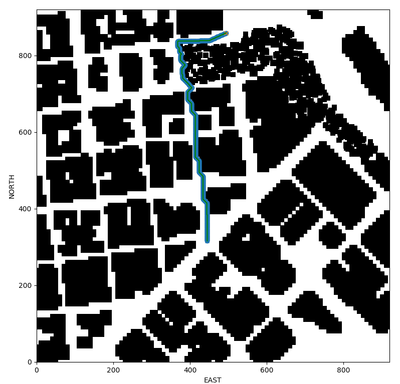
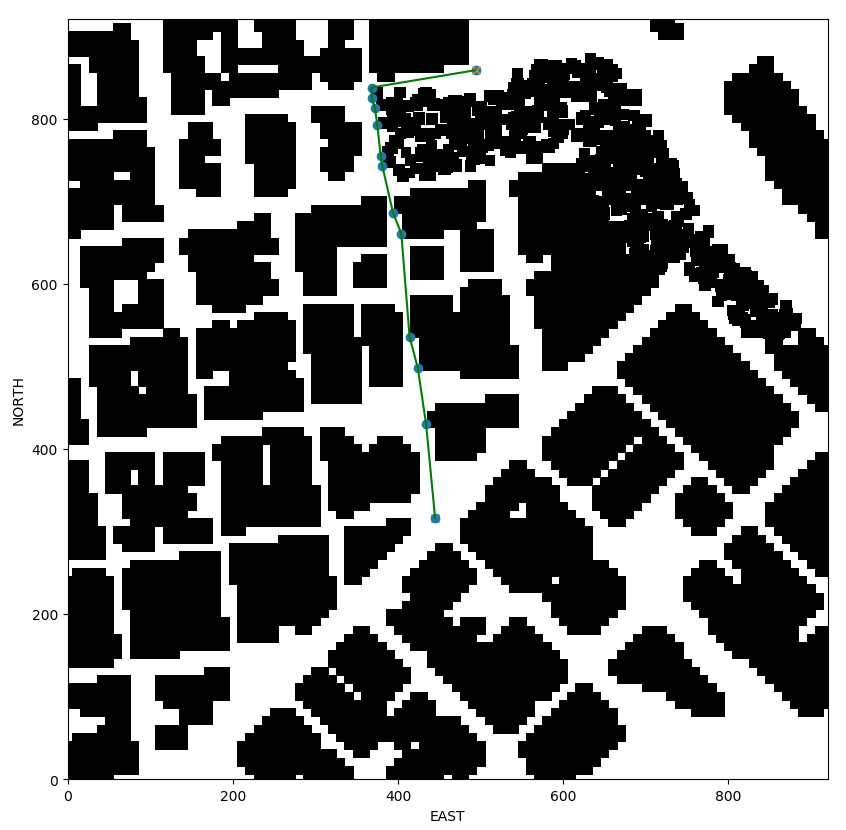
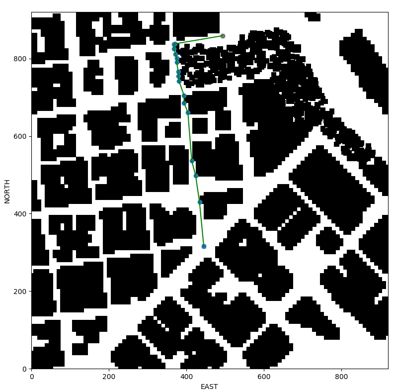

## Project: 3D Motion Planning


---


# Required Steps for a Passing Submission:
1. Load the 2.5D map in the colliders.csv file describing the environment.
2. Discretize the environment into a grid or graph representation.
3. Define the start and goal locations.
4. Perform a search using A* or other search algorithm.
5. Use a collinearity test or ray tracing method (like Bresenham) to remove unnecessary waypoints.
6. Return waypoints in local ECEF coordinates (format for `self.all_waypoints` is [N, E, altitude, heading], where the drone’s start location corresponds to [0, 0, 0, 0].
7. Write it up.
8. Congratulations!  Your Done!

## [Rubric](https://review.udacity.com/#!/rubrics/1534/view) Points
### Here I will consider the rubric points individually and describe how I addressed each point in my implementation.  

---
### Writeup / README

#### 1. Provide a Writeup / README that includes all the rubric points and how you addressed each one.  You can submit your writeup as markdown or pdf.  

You're reading it! Below I describe how I addressed each rubric point and where in my code each point is handled.

### Explain the Starter Code

#### 1. Explain the functionality of what's provided in `motion_planning.py` and `planning_utils.py`
Both these scripts contain similar frameworks for navigating a drone through an environment.

The difference between `motion_planning.py` and `backyard_flyer_solution.py` is that the `motion_planning.py` script includes scaffolding to perform one more task: planning a flight path to a goal.  To achieve this, among other smaller complimentary changes, ```motion_planning.py``` includes a new drone state, `PLANNING`. The purpose of which is to calculate a plan before taking off. More concretely, we have the following drone states, in order of execution, with the difference in bold.

backyard_flyer_solution.py | motion_planning.py
-- | --
`MANUAL`<br/>`ARMING`<br/>`TAKEOFF`<br/>`WAYPOINT`<br/>`LANDING`<br/>`DISARMING`<br/>`MANUAL` |`MANUAL`<br/>`ARMING`<br/>**`PLANNING`**<br/>`TAKEOFF`<br/>`WAYPOINT`<br/>`LANDING`<br/>`DISARMING`<br/>`MANUAL`

Once the drone is in the ```PLANNING``` state, it defines start and goal positions, and calculates a flight path from said start and goal positions. To achieve this, the script:

1. Loads collision data (a series of positions and size data of obstacles) of the environment
2. Generates a grid representation of a 2D configuration space at a static altitude
3. Performs A* search from the start and goal positions, over that configuration space
4. Generates waypoints from the path returned by A*
5. Sends the generated waypoints to the drone
6. Transitions into takeoff and beyond, when it executes the flight plan and performs the remaining state transitions as expected, until finally landing

```motion_planning.py``` also includes additional imports to support its extra functionality and additional arguments to customize where to send control commands.

To perform the above work, ```motion_planning.py``` imports planning related functions from ```planning_utils.py```:

1. An implementation of A*
   1. A path finding algorithm that expands partial plans , guided by a heuristic function
2. An implementation of a heuristic function that can be used with A*
   1. An underestimate of the true cost to the goal from the current position 
3. ```create_grid```, which generates a grid representation of a 2D configuration space
   1. Reads obstacle data at a given altitude, and returns a grid containing information 

An image of `motion_planning.py` in action, executing a flight plan in a simulator:


### Implementing Your Path Planning Algorithm

#### 1. Set your global home position

To set the global home position, I created a function to read just the first line of ```colliders.csv ``` to extract the lat0 and lon0 values. This function is the first step of path planning.

#### 2. Set your current local position

For this step, I created the helper function ```self.load_and_set_home_position``` that reads in the first line from ```colliders.csv```, parses lat0 and lon0, and sets the home position by calling ```self.set_home_position```.

#### 3. Set grid start position from local position
Next, to set the grid start position from the local position, I first needed to convert the drone's current geodetic coordinates to a local position (which are in meters, relative to the global home, and are the units the grid is discretized in).

#### 4. Set grid goal position from geodetic coords
To set arbitrary goal positions within the simulated map using geodetic coordinates, we simply need to convert the goal geodetic coordinates to local coordinates, and apply the grid offsets to set the grid goal.

#### 5. Modify A* to include diagonal motion (or replace A* altogether)
To allow A* to consider diagonal motions, we simply need to return additional valid actions with the correct cost. These additional actions are ```NORTH_WEST```, ```NORTH_EAST```, ```SOUTH_WEST```, ```SOUTH_EAST```, each of which have the same cost, ```sqrt(2)```.

Additionally, we have to check that from a given position, the new actions are in fact valid. To accomplish this, in the same way as the default actions, we check if these new actions will result in steps off the grid, or result in collisions.

To compare results, we can examine the cost of the plan before and after we introduce diagonal motion. Also, potentially given more time to test, a different start and goal position that results in a path with more turns may show a bigger improvement.

| Diagonal motion | Cost    | Number of nodes in path |
| --------------- | ------- | ----------------------- |
| No              | 746     | 747                     |
| Yes             | ~706.23 | 648                     |

#### 6. Cull waypoints 
Without any optimizations, the path calculated by A* includes all 1 meter steps towards the destination, which causes causes the drone to fly erratically because the planner tells the drone to start and stop at everyone one of those destinations.

To resolve this, we optimize the number of waypoints required to executing a basically equivalent flying path but culling redundant destinations. One approach, that we use here, is to use the bresenham algorithm. The bressenham algorithm tells us which cells on a grid intersect a given line. We will use a library function that provides us an implementation.

To cull waypoints, we iterate over all waypoints in the path in order, 3 destination at a time (```p1```, ```p2```, and ```p3```). To determine if a destination can be removed, we determine all cells that collide with the line between ```p1``` and ```p3``` by calling the bressenham library function, and determine if these cells contains obstacles on our grid. If there are no obstacles between ```p1``` and ```p3```, we can cull ```p2```.

| Type of path        | Number of nodes in path | Image                                         |
| ------------------- | ----------------------- | --------------------------------------------- |
| Unoptimized         | 747                     |         |
| Pruned              | 17                      |   |
| Diagonal and pruned | 19                      |  |


### Execute the flight
#### 1. Does it work?
It works from multiple starting positions!
